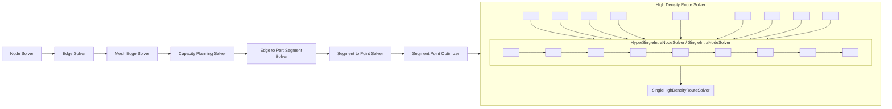

# @tscircuit/capacity-autorouter

An MIT-licensed full-pipeline PCB autorouter library for node.js and TypeScript projects. Part of [tscircuit](https://github.com/tscircuit/tscircuit)

[View Online Playground](https://unraveller.vercel.app) &middot; [tscircuit docs](https://docs.tscircuit.com) &middot; [discord](https://tscircuit.com/join) &middot; [twitter](https://x.com/seveibar) &middot; [try tscircuit online](https://tscircuit.com)

Check out this [short youtube explanation of this autorouter](https://youtu.be/MmTk0806fAo)

## How to file a bug report

1. You should have [created a bug report via the tscircuit errors tab](https://docs.tscircuit.com/contributing/report-autorouter-bugs)
2. Run `bun run bug-report <bug-report-url>`
3. This will download the bug report and create a debugging fixture file in the `examples/bug-reports` directory, you can then find the bug report in the server (via `bun run start`)

## Installation

```bash
bun add @tscircuit/capacity-autorouter
```

## Usage as a Library

### Basic Usage

```typescript
import { CapacityMeshSolver } from "@tscircuit/capacity-autorouter"

// Create a solver with SimpleRouteJson input
const solver = new CapacityMeshSolver(simpleRouteJson)

// Run the solver until completion
while (!solver.solved && !solver.failed) {
  solver.step()
}

// Check if solving was successful
if (solver.failed) {
  console.error("Routing failed:", solver.error)
} else {
  // Get the routing results as SimpleRouteJson with traces
  const resultWithRoutes = solver.getOutputSimpleRouteJson()

  // Use the resulting routes in your application
  console.log(
    `Successfully routed ${resultWithRoutes.traces?.length} connections`
  )
}
```

### Input Format: SimpleRouteJson

The input to the autorouter is a `SimpleRouteJson` object with the following structure:

```typescript
interface SimpleRouteJson {
  layerCount: number
  minTraceWidth: number
  obstacles: Obstacle[]
  connections: Array<SimpleRouteConnection>
  bounds: { minX: number; maxX: number; minY: number; maxY: number }
  traces?: SimplifiedPcbTraces // Optional for input
}

interface Obstacle {
  type: "rect"
  layers: string[]
  center: { x: number; y: number }
  width: number
  height: number
  connectedTo: string[] // TraceIds
}

interface SimpleRouteConnection {
  name: string
  pointsToConnect: Array<{ x: number; y: number; layer: string }>
}
```

### Output Format

The `getOutputSimpleRouteJson()` method returns the original `SimpleRouteJson` with a populated `traces` property. The traces are represented as `SimplifiedPcbTraces`:

```typescript
type SimplifiedPcbTraces = Array<{
  type: "pcb_trace"
  pcb_trace_id: string // TraceId
  route: Array<
    | {
        route_type: "wire"
        x: number
        y: number
        width: number
        layer: string
      }
    | {
        route_type: "via"
        x: number
        y: number
        to_layer: string
        from_layer: string
      }
  >
}>
```

### Advanced Configuration

You can provide optional configuration parameters to the solver:

```typescript
const solver = new CapacityMeshSolver(simpleRouteJson, {
  // Optional: Manually set capacity planning depth (otherwise automatically calculated)
  capacityDepth: 7,

  // Optional: Set the target minimum capacity for automatic depth calculation
  // Lower values result in finer subdivisions (higher depth)
  targetMinCapacity: 0.5,
})
```

By default, the solver will automatically calculate the optimal `capacityDepth` to achieve a target minimum capacity of 0.5 based on the board dimensions. This automatic calculation ensures that the smallest subdivision cells have an appropriate capacity for routing.

### Visualization Support

For debugging or interactive applications, you can use the `visualize()` method to get a visualization of the current routing state:

```typescript
// Get visualization data that can be rendered with graphics-debug
const visualization = solver.visualize()
```

## System Architecture



The autorouter uses a multi-step approach that includes:

1. **Node Solving**: Determines node placement
2. **Edge Solving**: Creates connections between nodes
3. **Mesh Edge Solving**: Refines connection patterns
4. **Capacity Planning**: Allocates routing resources
5. **Edge to Port Segment Solving**: Connects segments to ports
6. **Segment to Point Solving**: Converts segments to exact point locations
7. **Segment Point Optimization**: Optimizes point placements for better routing
8. **High Density Routing**: Final detailed routing with obstacle avoidance

## Development

To work on this library:

```bash
# Install dependencies
bun install

# Start the interactive development environment
bun run start

# Run tests
bun test

# Build the library
bun run build
```

## License

See the [LICENSE](LICENSE) file for details.
