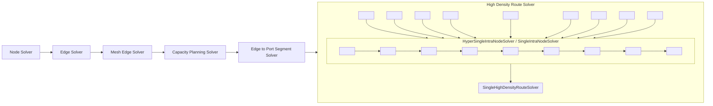

# capacity-node-autorouter

[tscircuit project](https://github.com/tscircuit/tscircuit) &middot; [discord](https://tscircuit.com/join) &middot; [twitter](https://x.com/seveibar) &middot; [try tscircuit online](https://tscircuit.com)

Check out this [short youtube explanation of this autorouter](https://youtu.be/MmTk0806fAo)

## System Diagram



## Development

To install dependencies:

```bash
bun install
```

To run:

```bash
bun run start
```
